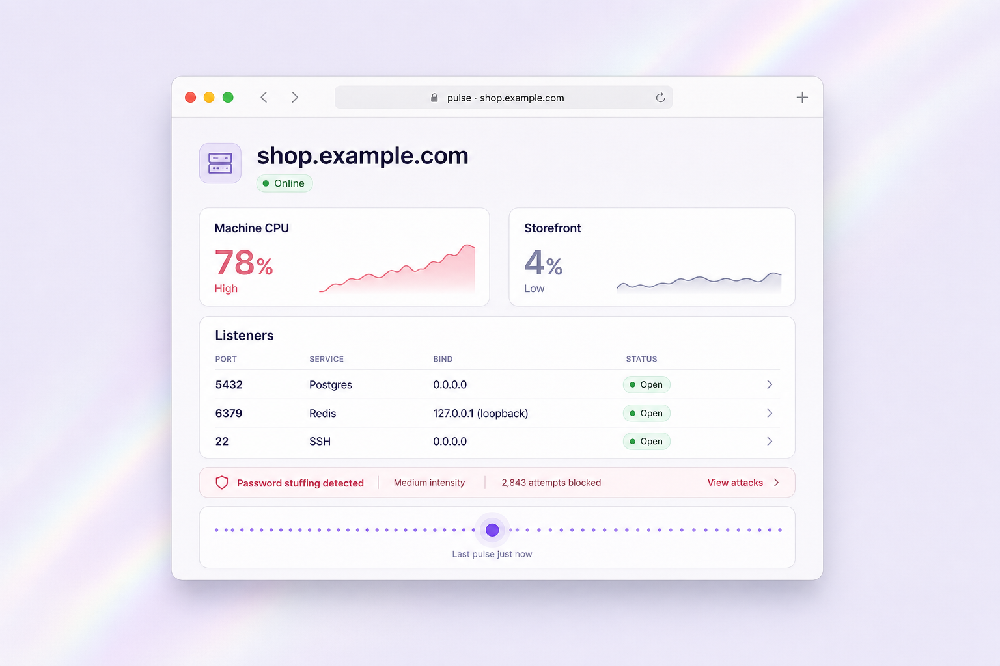
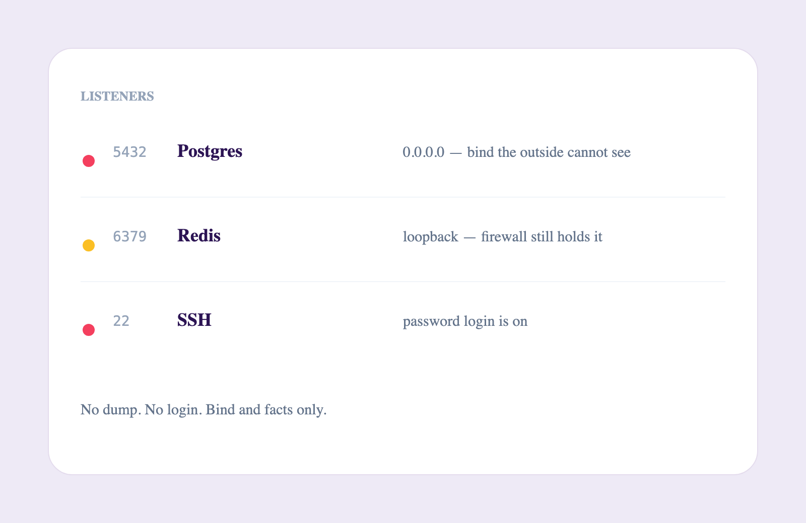
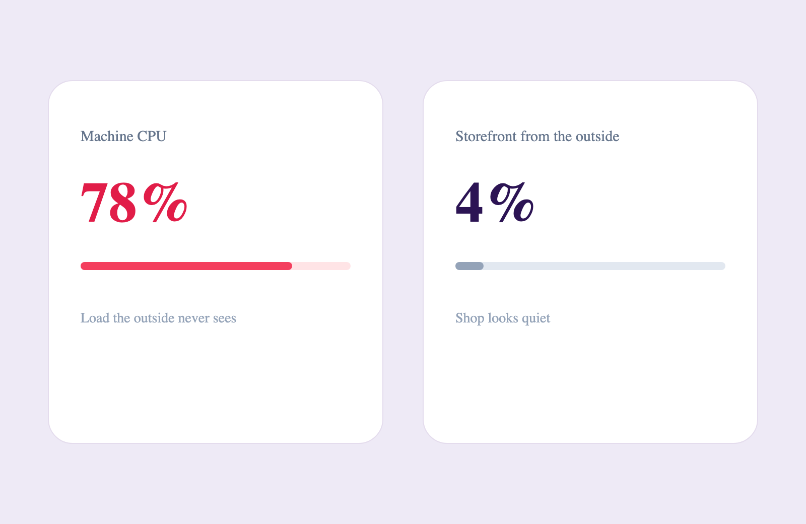
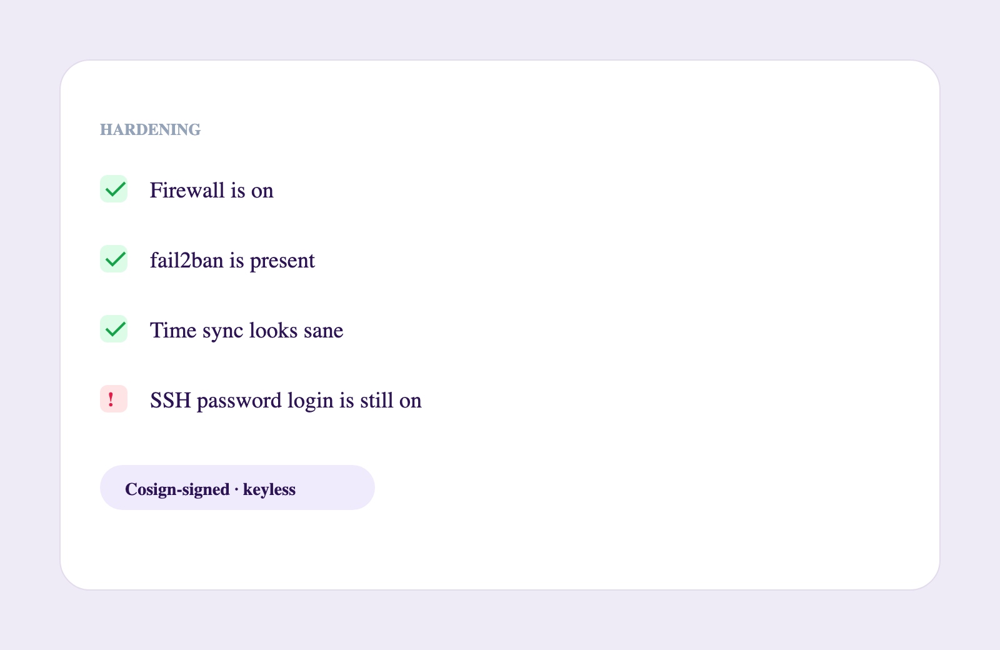
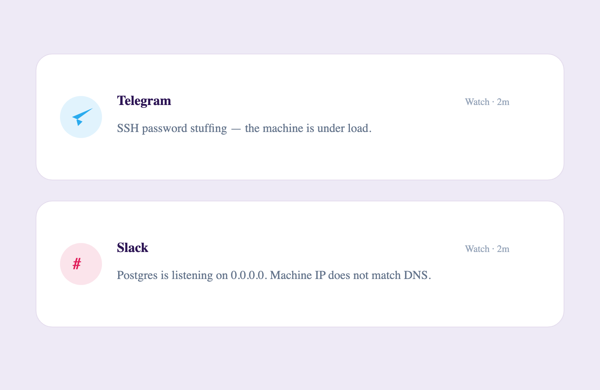

<p align="center">
  <a href="https://orb44.com">
    
  </a>
</p>

<h2 align="center">Watch satellite — inside the machine</h2>

<p align="center">The optional agent for <a href="https://orb44.com">Orb44</a>. One command on your VPS. Load, listeners, hardening — on the same card as the outside snapshot. The dashboard never runs commands on the host.</p>

<p align="center">
  <a href="https://orb44.com"> Website</a>
  ·
  <a href="https://app.orb44.com"> Dashboard</a>
  ·
  <a href="https://www.npmjs.com/package/@orb44/cli"> npm</a>
  ·
  <a href="./SECURITY.md"> Security</a>
</p>

<p align="center">
  <a href="https://orb44.com/#satellite">
    <picture>
      <source media="(prefers-color-scheme: dark)" srcset="./docs/readme/github-cover-dark.png" />
      <source media="(prefers-color-scheme: light)" srcset="./docs/readme/github-cover-light.png" />
      
    </picture>
  </a>
</p>

<br />

# Why a satellite

Orb44’s outside view sees what a passerby sees. Bind addresses on `127.0.0.1`, load spikes, failed units, and “Redis on all interfaces” are invisible from the internet. One device on a machine you own closes that gap.

This repository is the open surface of **`@orb44/cli`**. It does **not** run remote shells, does **not** dump databases, and does **not** accept inbound commands from the cloud. The dashboard only receives the pulse you send.

<br />

# Install

Pin a version. Bare `npx @orb44/cli` goes stale.

```bash
# Node 18+ · Linux or macOS
npx @orb44/cli@0.1.13 login --url https://app.orb44.com
```

Open the printed link while signed into the dashboard, confirm the domain, then optionally install the systemd daemon (default: no).

```bash
npx @orb44/cli@0.1.13 status
npx @orb44/cli@0.1.13 pulse
npx @orb44/cli@0.1.13 install
orb44 update
npx @orb44/cli@0.1.13 logout
```

Device key: `~/.config/orb44/device.json` (mode `0600`). Revocable from the dashboard and from the CLI. Not a shell token.

<br />

# What the pulse sees

Advice text only. Nothing is executed on your machine.

<table align="center">
  <tr>
    <td width="50%">
      
      <p align="center">Who is listening — real bind, not a guess from an open port</p>
    </td>
    <td width="50%">
      
      <p align="center">Load the outside never sees — CPU vs a quiet storefront</p>
    </td>
  </tr>
  <tr>
    <td width="50%">
      
      <p align="center">Firewall, fail2ban, SSH password login — facts from the host</p>
    </td>
    <td width="50%">
      
      <p align="center">Watch alerts on Telegram and Slack when the picture moves</p>
    </td>
  </tr>
</table>

Optional short error tails only if you grant `logs` at login.

<br />

# Security

See [SECURITY.md](./SECURITY.md). Releases from this repository are **Cosign-signed** via GitHub Actions (keyless OIDC). Verify before you trust a tarball on a production host.

Runs as a regular user, not root. The daemon is optional.

<br />

# What this is not

- Not a licensed pentest
- Not Nuclei / full DAST
- Not a WAF or CDN
- Not AI-code / repository SAST

<br />

# Stack

- Node 18+
- Outbound HTTPS pulse only
- Optional systemd unit
- Cosign / GitHub OIDC on release

<br />

# Lead home

After a local pulse, open the dashboard for graphs, history, and alerts:

**https://app.orb44.com**

